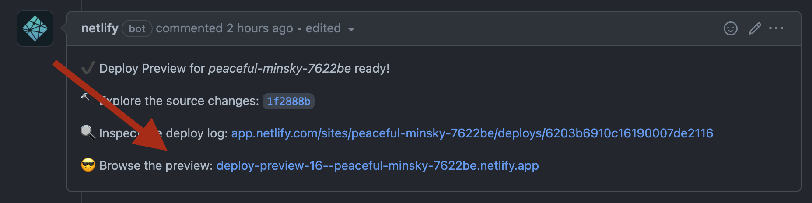

# YaleSites Twig Component Library

All YaleSites projects have access to components in the YaleSites component library. Themes may choose which variations of components to implement, and options are available.

## Installation

<details><summary>Prerequisites</summary>

Each environment that needs to pull @yalesites-org packages from GitHub needs to be authenticated using a "Personal Access Token". This only needs to be done once per-environment.

- Go to `https://github.com/settings/tokens/new`
  - In the "Note" field add something like "YaleSites GitHub Packages"
  - Choose an expiration value
  - Check the box for "write:packages" (this will automatically check all of the "repo" boxes as well)
  - Click "Generate token"
- On your local machine, create an environment variable. This process varies depending on the shell and operating system you use. It will be something similar to this though: `export KEY=value`.
  - The `key` for YaleSites projects needs to be `YALESITES_BUILD_TOKEN`
  - The `value` is the token you created above
- Done!

</details>

### Installing the package

There must be a `.npmrc` file in the project root that tells npm to get `@yalesites-org` packages from GitHub rather than npm.

- Create a `.npmrc` file in your project root (or modify an existing one) and add the following:

```bash
@yalesites-org:registry=https://npm.pkg.github.com
```

Then you can install the package like any other npm dependency.

```bash
npm install @yalesites-org/component-library-twig
```

## Releases

Any time something is pushed to the `main` branch on GitHub, a [GitHub Action](.github/workflows/release.yml) is run to determine whether a new release is needed (via semantic-release.)

This is an entirely automated process, so whether changes are pushed directly to `main` or if they go through the preferred PR workflow the release process will be run.

## Live Component Library

You can view the latest version of the component library at any time by visiting the [Deployed Storybook](https://yalesites-org.github.io/component-library-twig/?path=/story/tokens-colors--colors). All new commits to the `main` branch trigger a rebuild and deploy of the component library, so it will always be up-to-date with the latest released code.

## Development Component Libraries

The `develop` branch also has an auto-deployed component library. This will contain all of the work that will go out in the next release. It is [deployed to netlify](https://dev-component-library-twig.netlify.app).

PRs also have auto-deployed component libraries, which allow reviewers to load the latest state of a PR at any given time without having to fiddle with local tooling. Each PR will have a link posted to the PR comments by the "netlify bot" when the link is ready. See screenshot below.


