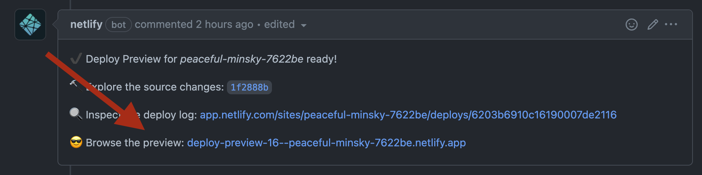

# YaleSites Twig Component Library

All YaleSites projects have access to components in the YaleSites component library. Themes may choose which variations of components to implement, and options are available.

## Installation

<details><summary>Prerequisites</summary>

Each environment that needs to pull @yalesites-org packages from GitHub needs to be authenticated using a "Personal Access Token". This only needs to be done once per-environment.

- Go to `https://github.com/settings/tokens/new`
  - In the "Note" field add something like "YaleSites GitHub Packages"
  - Choose an expiration value
  - Check the box for "write:packages" (this will automatically check all of the "repo" boxes as well)
  - Click "Generate token"
- On your local machine, create an environment variable. This process varies depending on the shell and operating system you use. It will be something similar to this though: `export KEY=value`.
  - The `key` for YaleSites projects needs to be `YALESITES_BUILD_TOKEN`
  - The `value` is the token you created above
- Done!

- [Here's a stack overflow post showing how to set persistent environment variables for various shells](https://unix.stackexchange.com/questions/117467/how-to-permanently-set-environmental-variables)

</details>

### Installing the component library locally

If you want to work directly on the component library locally, you can clone this repo and install the dependencies as described below.

1. Clone the repository `git clone git@github.com:yalesites-org/component-library-twig.git`
2. Change directories into the repo `cd component-library-twig`
3. Verify you're using the correct version of node `nvm use`
4. Install dependencies `npm install`
5. Run the develop script `npm run develop`
6. Make your changes and commit them!

### Installing the package in another project

There must be a `.npmrc` file in the project root that tells npm to get `@yalesites-org` packages from GitHub rather than npm.

- Create a `.npmrc` file in your project root (or modify an existing one) and add the following:

```bash
@yalesites-org:registry=https://npm.pkg.github.com
```

Then you can install the package like any other npm dependency.

```bash
npm install @yalesites-org/component-library-twig
```

## Releases

Any time something is pushed to the `main` branch on GitHub, a [GitHub Action](.github/workflows/release.yml) is run to determine whether a new release is needed (via semantic-release.)

This is an entirely automated process, so whether changes are pushed directly to `main` or if they go through the preferred PR workflow the release process will be run. Merges into `main` should be performed using a merge commit.

## The contrast gate

Colour contrast is a measurable property of the tokens, not a matter of judgement, so it is checked by the build rather than by whoever happens to review the PR. Two checks run as part of `npm run test` and therefore gate every pull request.

### 1. The pairing gate

`components/00-tokens/colors/contrast-gate.test.mjs` computes the WCAG 2.1 contrast ratio for every **approved pairing** — every surface the token package declares together with the foreground meant to sit on it — across all seven global themes, and fails below **4.5:1 for text** (SC 1.4.3) and **3:1 for non-text**, currently section borders (SC 1.4.11). It also enforces the #1539 convention that slot one, slot six and slot seven are safe foregrounds.

See the report, including the pairings that are measured but deliberately not gated:

```sh
node components/00-tokens/colors/contrast-gate.mjs   # or: npm run contrast:gate
```

**Adding an approved pairing.** Surfaces are enumerated in `approved-pairings.mjs`, derived from the token package rather than listed by hand, so adding a global theme, a section theme or a component theme brings its pairings in automatically — and if one of them fails, the build tells you before it reaches a site. Add a *new kind* of surface by adding a function there and its name to `PAIRING_KINDS`; the tests will fail until it produces pairings, which is deliberate.

**When the gate fails.** Fix the colours. `contrast-gate-baseline.json` is a burn-down list of the failures that already existed when the gate landed, each with a reason and an owning ticket — it is not an opt-out, and the tests enforce that: an entry that starts passing must be deleted, an entry naming a pairing that no longer exists must be deleted, and an entry with no reason or no ticket fails.

### 2. The foreground-purity ratchet

The gate can only check colours that appear in a declared pairing. A component that hardcodes a colour in foreground position is not merely failing — it is unmeasured. That half is caught two ways:

- **Colour literals** (`color: #fff`, `color: white`) — a stylelint rule, see `stylelint.config.js`.
- **Raw palette tokens** (`color: var(--color-gray-700)`, and the fallback half of `color: var(--color-section-foreground, var(--color-blue-yale))`) — `foreground-purity.test.mjs`, because stylelint's property matching does not reach custom-property declarations in this tree.

A palette token is a fixed swatch: it cannot follow the theme. Read a semantic token instead — `--color-text`, `--color-heading`, `--color-link-base`, or the section contract `--color-section-background` / `--color-section-foreground` / `--color-section-accent`.

```sh
node components/00-tokens/colors/foreground-purity.mjs   # or: npm run contrast:foregrounds
```

`foreground-purity-baseline.json` holds the per-file counts as they stood when the ratchet landed. They may only go **down**: no file may gain one, a file that is not listed must have none, and a file that has been cleaned must have its entry deleted. Raising a number to turn a red build green is not a fix.

## Storybook Documentation Structure

The YaleSites Component Library uses a modern two-page documentation structure for components:

### 1. Documentation Page (MDX)
Educational content focused on helping developers understand and use components:
- Component introduction and use cases
- Interactive preview with controls
- Property documentation (required/optional)
- Theme options
- Key variants (2-4 representative examples)
- Technical specifications (accessibility, behavior)
- Usage guidelines and best practices

**Files**: `[component].mdx`

### 2. Visual Regression Page (Visreg)
Comprehensive testing page with all component variations:
- Interactive controls section
- All theme variations
- All component variations
- Visual regression testing coverage

**Files**: `[component].visreg.stories.js`

### Migration Guide

For detailed instructions on creating or migrating components to this structure, see the [Storybook Migration Guide](STORYBOOK-MIGRATION-GUIDE.md).

### Example Components

The following components have been fully migrated and serve as reference examples:
- **Accordion**: `components/02-molecules/accordion/`
- **Alert**: `components/02-molecules/alert/`

## Live Component Library

You can view the latest version of the component library at any time by visiting the [Deployed Storybook](https://yalesites-org.github.io/component-library-twig). All new commits to the `main` branch trigger a rebuild and deploy of the component library, so it will always be up-to-date with the latest released code.

## Development Component Libraries

The `develop` branch also has an auto-deployed component library. This will contain all of the work that will go out in the next release. It is [deployed to netlify](https://dev-component-library-twig.netlify.app).

PRs also have auto-deployed component libraries, which allow reviewers to load the latest state of a PR at any given time without having to fiddle with local tooling. Each PR will have a link posted to the PR comments by the "netlify bot" when the link is ready. See screenshot below.



## Thanks

<a href="https://www.chromatic.com/"></a>

Thanks to [Chromatic](https://www.chromatic.com/) for providing the visual testing platform that helps us review UI changes and catch visual regressions.
